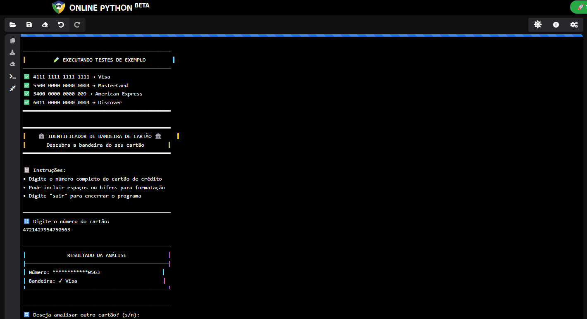

# 🏦 Projeto DIO do Curso GitHub Copilot - Identificador de Bandeira de Cartão de Crédito




Uma aplicação Python simples e elegante para identificar a bandeira de cartões de crédito (Visa, MasterCard, American Express, etc.) com base no número fornecido.

## ✨ Características

- **Interface Visual Atraente**: Interface textual com bordas, símbolos e formatação elegante
- **Múltiplas Bandeiras**: Suporte para Visa, MasterCard, American Express, Discover, Diners Club e JCB
- **Segurança**: Mascaramento automático dos números de cartão para proteção de dados
- **Validação Robusta**: Verificação completa da entrada com tratamento de erros
- **Código Limpo**: Estrutura modular e bem documentada com docstrings


## 🚀 Como Usar

1. Execute o script Python:
```bash
python main.py
```

2. Digite o número do cartão de crédito quando solicitado
3. Visualize a bandeira identificada de forma segura e elegante

## 🔧 Funcionalidades

- Identificação automática de bandeiras baseada em padrões oficiais
- Interface interativa com menu de navegação
- Testes automatizados incluídos
- Tratamento de exceções e erros
- Formatação flexível (aceita espaços e hífens)


## 📋 Requisitos

- Python 3.6+


## 🛡️ Segurança

O aplicativo **não armazena** nem **transmite** informações de cartão. Todos os dados são processados localmente e mascarados para exibição segura.

